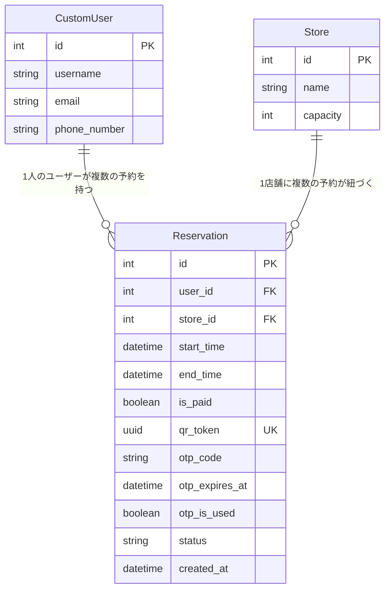

# 省人化店舗運営システム MVP

🚀 **Live Demo:** https://my-mvp-app-w6x2.onrender.com
> RenderのFreeプランのため、初回アクセス時は起動まで約1分かかる場合があります。

## プロジェクトの目的（Why）

ホテルフロントでの接客業務の経験から、「定型業務はシステムで自動化し、人間は付加価値の高い接客に集中すべきだ」という仮説を立て、その検証のために開発しています。予約から入退店までの店舗オペレーションをシステム化し、省人化を実現するプラットフォームのMVPです。

## 実装機能

**✅ 実装済み**
- カスタムユーザーモデル（`CustomUser`）による新規登録・ログイン・ログアウト
- `@login_required` によるアクセス制限ガード
- 店舗一覧の表示・予約作成（Create）・予約一覧確認（Read）
- 予約確定時のUUID自動生成による QRトークン発行
- Django Admin を用いた管理画面
- Render（PostgreSQL / Gunicorn / WhiteNoise）への本番デプロイ

**🚧 実装予定**
- 予約変更・キャンセル（Update / Delete）
- OTPによる実店舗チェックイン認証

## 技術スタック

| カテゴリ | 技術 |
|---|---|
| Backend | Python 3.12 / Django 6.0 |
| Database | PostgreSQL（本番） / SQLite3（開発） |
| Infrastructure | Render (Web Service + PostgreSQL) |
| Package Manager | uv |

## ローカル開発環境セットアップ

```bash
git clone https://github.com/Uzu83/my_mvp_project.git
cd my_mvp_project
uv sync
uv run python manage.py migrate
uv run python manage.py runserver
```

## ER図



## 設計の意思決定

**Djangoを選んだ理由**
最短でMVPを構築して仮説検証を行うため。Admin機能により管理画面の実装コストを削減し、コア機能の開発に集中できる。

**OTPカラムをReservationテーブルに持たせた理由**
本MVPでは監査ログの要件がないため、別テーブルに正規化せずReservationに直接カラムを持たせて上書きする設計とした。JOIN不要でクエリをシンプルに保ち、初期の実装コストを下げる意図がある。

