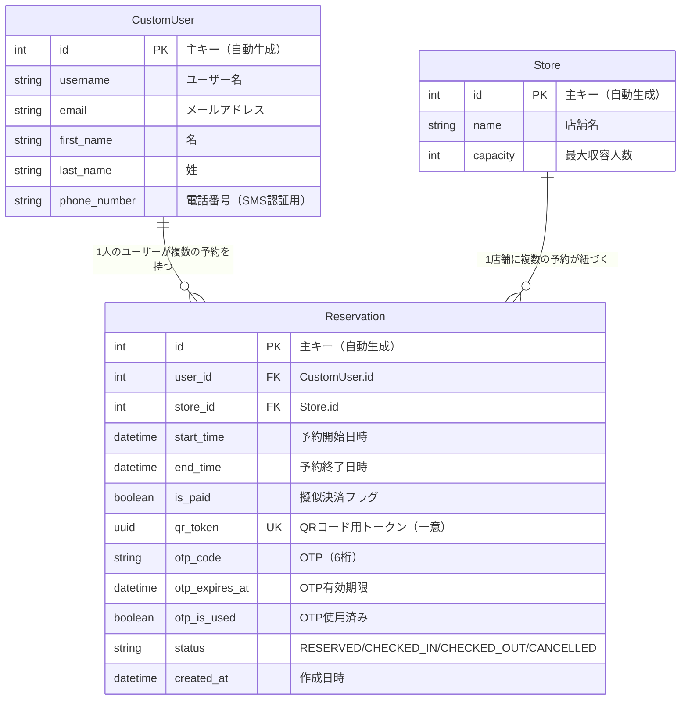

# 省人化店舗運営システム MVP

## プロジェクトの目的（Why）
「人が行う接客」を付加価値（プレミアム）として再定義するため、予約から入退店までの店舗オペレーションをシステム化し、省人化を実現するプラットフォームのMVP（最小限のプロダクト）です。
自身の接客アルバイト経験から、「基本業務はシステムで自動化し、人間は本当に必要な接客のみを行うべきだ」という仮説を立て、その検証のために開発しています。

## 現在のステータス
**✅ Implemented（実装済み）**
- データベース設計とモデル構築（`CustomUser`, `Store`, `Reservation`）
- Django Adminを用いた管理画面の構築
- 店舗一覧ページの表示（MTVアーキテクチャの連携）

**🚧 Planned / WIP（実装予定・進行中）**
- 一般ユーザー向けの予約作成機能（擬似決済フラグ）
- QRコード発行（UUID自動生成）
- OTP（ワンタイムパスワード）を用いたチェックイン認証ロジックの実装
- Renderへのデプロイ（PostgreSQL環境）

## 技術スタック
- **Backend:** Python / Django 6.0.x
- **Database:** SQLite（開発環境） / PostgreSQL（本番想定）
- **Infrastructure:** Render（デプロイ予定）
- **Package Manager:** uv

## 開発環境セットアップ
```bash
# パッケージの同期
uv sync

# マイグレーションの適用
uv run python manage.py migrate

# 開発サーバーの起動
uv run python manage.py runserver

```

## ER図



## 設計の意思決定
<<<<<<< HEAD

* **Djangoの選定理由:**
長期間かけて開発するのではなく、最短で動くMVPを構築して仮説検証を行うため。標準搭載の強力なAdmin機能により、管理側画面の実装コストを大幅に削減できる点も採用理由です。
* **OTP（ワンタイムパスワード）のテーブル設計:**
本MVPでは監査ログの要件がないため、別テーブルに正規化せず、`Reservation`テーブルに直接カラム（`otp_code`, `otp_expires_at`等）を持たせて上書きする設計としました。これにより、JOIN不要でクエリをシンプルに保ち、初期の実装コストを下げる意図があります。

```

=======
- OTPモック実装にした理由：...
- UUIDをqr_tokenに使った理由：...

現在Phase 2進行中：店舗一覧のMTVアーキテクチャ実装完了
>>>>>>> 6dd91a446ab1b51d26eec5bff97b7753e16648f1
